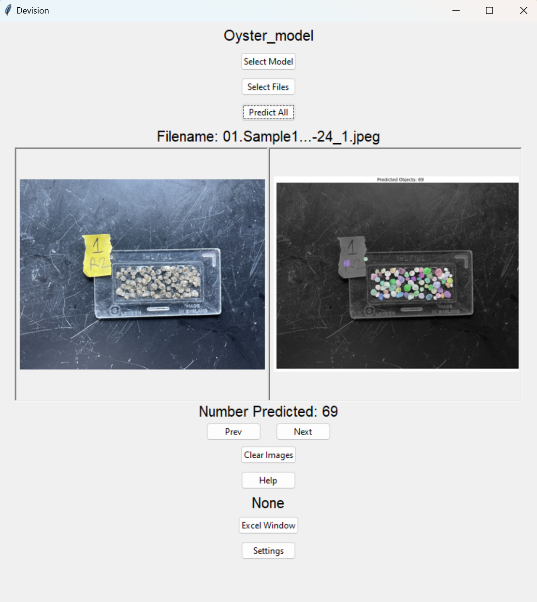

# Louisiana-Sea-Grant- Oyster Project

# Project Overview

Developed by the Oyster Team at the LSU Department of Mathematics during Summer 2024, this innovative project aims to automate the counting of oyster seeds from images. In collaboration with the Louisiana Sea Grant Research Lab and under the guidance of Dr. Sarah Bodenstein, the project addresses a critical need in marine research. The primary objective is to create a robust image segmentation program that can accurately count oyster seeds, replacing the current manual counting methods used in research labs.

## Methodology and Preparation

The oyster seed dataset was categorized into three size ranges: 0-2 mm, 2-4 mm, and >4 mm. Using LabKit software integrated with Fiji, each seed in the images was annotated to provide the ground truth data necessary for model training. To enhance the dataset, a rotation process was implemented, generating additional image variations to increase the dataset size and improve the model's overall performance.

## Model Development

The core of the project involved applying the Stardist model, based on the U-net architecture—a type of convolutional neural network. Stardist excels in identifying star-convex polygons within images, which is crucial for accurately segmenting and counting individual oyster seeds.

## Results

The training process yielded promising results, with significant reductions in both probability loss and distance loss.

- **Accuracy**: The model achieved a peak accuracy of 91% on images with darker backgrounds. However, accuracy tended to decrease with lighter background images, indicating an area for further refinement.
  
- **User Interface**: This GUI image showcases the oyster counting application, which selects the best model, trained over 500 epochs, to accurately predict the count of oyster seeds in an image. For the sample image, the predicted number of oysters is 69, as displayed in the interface.

- 

## Research Team

**CEO:**  
Prof. Peter Wolenski (wolenski@math.lsu.edu)

**Mathematics Graduate and Undergraduate Students:**  
Alex P. Mensen-Johnson, Angel Wilson, Austin Louque, Christian Ennis, Fernando Heidercheidt, Gowri Priya Sunkara, Jackson Knox, Joshua C. Harris, Mark Herpin, Sunella A. Ramnath, Zachary James.

## Louisiana Sea Grant Research Lab

**Director:** Elizabeth M. Robinson  
**Postdoctoral Researcher:** Dr. Sarah Bodenstein

[Louisiana Sea Grant Research Lab](https://www.laseagrant.org/)

## LSU Department of Mathematics

[LSU Department of Mathematics](https://www.math.lsu.edu/)

---

**LSU Math Consultation Clinic:**  
[LSU Math Consultation Clinic](https://www.math.lsu.edu/courses/capstone_course)

[LSU](https://lsu.edu/)
